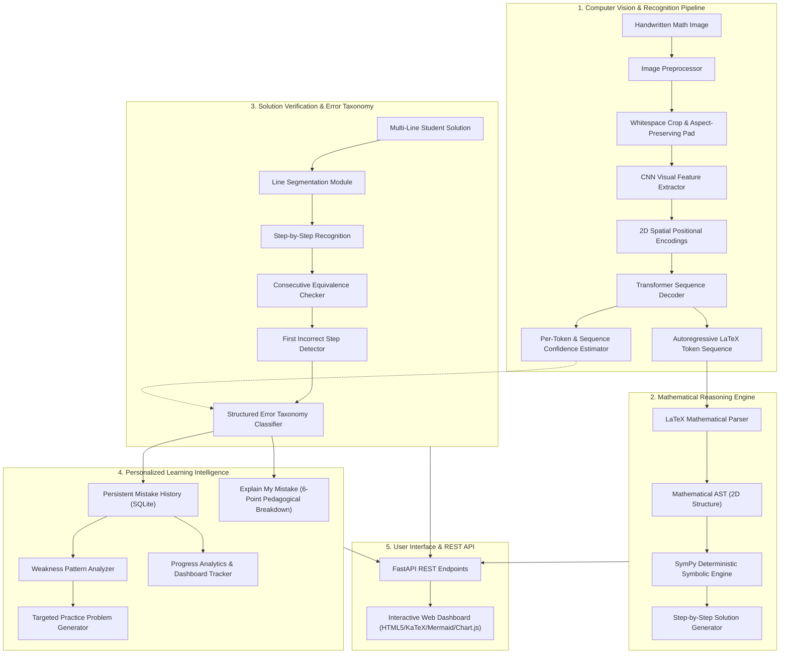

# System Architecture: AI-Based Handwritten Mathematical Expression Understanding & Personalized Learning System

## 1. High-Level Architecture Overview

The system is designed with a decoupled, research-grade, modular architecture where computer vision, mathematical reasoning, learning intelligence, and user presentation operate as independent modules with strict interfaces.

---

## 2. Core Subsystems

### 2.1 Computer Vision & Recognition Pipeline (`ml/`)
- **Whitespace Cropping & Aspect-Ratio Preservation (`ml/preprocessing.py`)**:
  - Raw input is converted to grayscale, and ink strokes are detected using intensity thresholding.
  - To prevent distortion of mathematical symbols, bounding boxes are calculated and uniformly resized using $\text{scale} = \min(H_{\max}/h, W_{\max}/w)$.
  - The uniformly scaled stroke is padded into a fixed canvas size $(128 \times 512)$ without altering the natural aspect ratio of the handwritten strokes.
  - Pixel intensities are inverted and normalized so ink features represent positive signals.
- **LaTeX Tokenizer (`ml/tokenizer.py`)**:
  - Handles mathematical macros (`\frac`, `\sqrt`, `\pm`, `\cdot`, `\int`, `\sum`), structural braces (`{`, `}`), superscripts (`^`), subscripts (`_`), arithmetic operators, digits `0-9`, and variables `a-z`, `A-Z`.
  - Includes standard control tokens: `<PAD>` (0), `<BOS>` (1), `<EOS>` (2), and `<UNK>` (3).
- **Vision-to-LaTeX Neural Model (`ml/model.py`)**:
  - **Encoder**: 4-stage convolutional backbone with batch normalization, ReLU activations, and adaptive pooling downsampling the input from $(B, 1, 128, 512)$ to spatial feature maps of dimension $(B, 256, 8, 32)$.
  - **2D Positional Encoding**: Incorporates sinusoidal 2D coordinate embeddings across both horizontal and vertical axes to encode spatial symbol relationships.
  - **Decoder**: Transformer decoder with causal triangular self-attention and cross-attention over visual feature sequences.
  - **Teacher Forcing & Loss**: Trained with causal padding-aware cross-entropy loss ignoring `<PAD>`.
- **Confidence Estimation & Ambiguity Detection (`ml/inference.py`)**:
  - Computes probability distributions $P(w_t \mid w_{<t}, \mathbf{I})$ at each decoding step.
  - Flags tokens where $P(w_t) < \tau$ (default 0.6) and isolates ambiguous character pairs (such as $x \leftrightarrow y$ or $+ \leftrightarrow t$).

---

### 2.2 Mathematical Structure & AST (`math_engine/ast.py`, `math_engine/latex_parser.py`)
- Preserves genuine 2D mathematical relationships:
  - Fractions: `DivNode(numerator, denominator)`
  - Powers & Superscripts: `PowNode(base, exponent)`
  - Roots: `SqrtNode(radicand, index)`
  - Grouping: `AddNode`, `SubNode`, `MulNode`
  - Relations: `EquationNode(lhs, rhs)`, `InequalityNode(lhs, op, rhs)`
- Serialization:
  - `to_dict()`: Hierarchical JSON representation.
  - `to_ascii_tree()`: ASCII tree representation for inspection and debugging.
  - `to_mermaid()`: Mermaid flowchart graph definition for dynamic client rendering.
  - `to_latex()`: Reconstructs normalized LaTeX.

---

### 2.3 Deterministic Symbolic Engine & Step Generator (`math_engine/solver.py`, `math_engine/step_generator.py`)
- Powered by SymPy for deterministic symbolic calculations (no LLMs or heuristic guesses):
  - Solves linear equations, quadratic equations, simultaneous equations, rational equations, and inequalities.
  - Performs algebraic expansion, factoring, simplification, differentiation, and integration.
- Generates transparent intermediate steps:
  - Linear equations: Distributes brackets $\to$ Isolates variable terms on LHS and constants on RHS $\to$ Combines like terms $\to$ Divides by coefficient.
  - Quadratic equations: Puts in standard form $ax^2 + bx + c = 0 \to$ Computes discriminant $\Delta = b^2 - 4ac \to$ Applies factoring or quadratic formula $\to$ Solves for roots.
  - Each step records: `step_number`, `expression_before`, `expression_after`, `operation`, and pedagogical `explanation`.

---

### 2.4 Multi-Step Handwritten Solution Verifier (`math_engine/verifier.py`)
- Extracts individual steps from multi-line handwritten images using horizontal projection profile analysis.
- Validates the mathematical deduction between consecutive lines:
  $$\Delta_k = \text{LHS}_k - \text{RHS}_k, \quad \Delta_{k+1} = \text{LHS}_{k+1} - \text{RHS}_{k+1}$$
- Verifies whether $\text{simplify}(\Delta_{k+1} - c \cdot \Delta_k) = 0$ or whether the solution sets $\mathcal{S}(\text{Step}_k) \equiv \mathcal{S}(\text{Step}_{k+1})$.
- Identifies the exact index $k$ of the first invalid deduction.

---

### 2.5 Structured Error Taxonomy Classifier (`math_engine/error_classifier.py`)
Implements 13 distinct error classes:
1. `Distribution Error`: Expanding $a(b + c)$ as $ab + c$.
2. `Sign Error`: Transposition without sign flip or negative distribution flaw.
3. `Arithmetic Error`: Valid algebraic structure but constant miscalculation.
4. `Fraction Error`: Invalid denominator addition or cancellation across addition.
5. `Exponent Error`: Violations of power rules (e.g. $(a+b)^2 \to a^2 + b^2$).
6. `Incorrect Transposition`: Subtracting instead of dividing, or wrong inverse operator.
7. `Incorrect Cancellation`: Canceling terms across addition in rational expressions.
8. `Missing Term`: Unexplained drop of a variable or constant term.
9. `Extra Term`: Spurious introduction of terms.
10. `Incorrect Substitution`: Substituting incorrect values or variables.
11. `Algebraic Manipulation Error`: General invalid transformation.
12. `Recognition Error`: Low visual confidence or single-character substitution yielding valid mathematics.
13. `Unknown/Other`: Fallback for unparseable input.

---

### 2.6 Learning Intelligence Layer (`learning/`)
- **Mistake History (`learning/mistake_history.py`)**: Persistent SQLite database (`data/learning_system.db`) tracking timestamps, topics, expressions, flawed steps, correct steps, mistake categories, and confidences.
- **Explain My Mistake (`learning/explain_mistake.py`)**: Delivers the 6-point pedagogical breakdown:
  1. What the student wrote
  2. What was expected
  3. Why the step is incorrect
  4. Mathematical rule involved
  5. The corrected step
  6. Actionable tip to avoid the mistake
- **Personalized Practice Generator (`learning/practice_generator.py`)**:
  - Automatically targets recurring weaknesses from the student's history.
  - Synthesizes parametric problems tailored to the error type.
  - Every problem is paired with a verified deterministic step-by-step solution.
- **Progress Analytics & Dashboard (`learning/progress.py`)**:
  - Aggregates total problems attempted, total correct, overall accuracy, recent accuracy (last 10 attempts), mistakes by category, topic mastery percentages, and active learning streaks.

---

### 2.7 Web Interface & REST API (`app/`)
- **Backend**: FastAPI REST server providing structured endpoints for `/api/recognize`, `/api/solve`, `/api/verify`, `/api/explain`, `/api/mistakes`, `/api/dashboard`, and `/api/practice`.
- **Frontend**: Clean, responsive interface featuring KaTeX for mathematical notation, Mermaid for dynamic AST trees, and Chart.js for progress visualizations.
