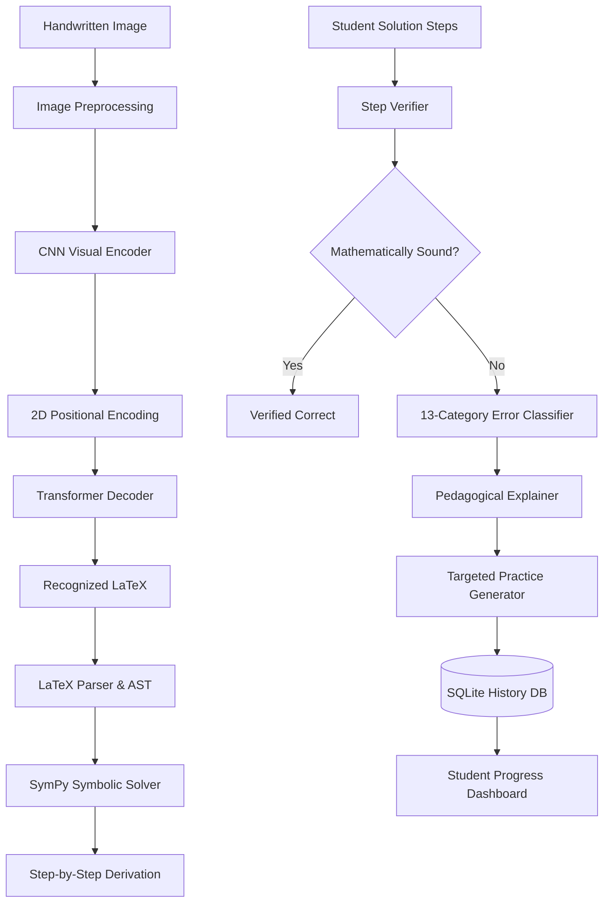

# 🧮 MathTutor AI: Handwritten Math Solver & Personalized Learning System

An end-to-end AI/ML system that recognizes handwritten math expressions, solves them step-by-step deterministically, audits student solutions, and generates personalized practice problems based on diagnosed weaknesses.

---

## 🌟 Key Features

* **Vision-to-LaTeX Recognition**: CNN Visual Encoder + 2D Positional Encoding + Transformer Decoder trained on the real-world `deepcopy/MathWriting-human` dataset.
* **Deterministic Symbolic Solver**: Uses SymPy to solve linear, quadratic, polynomial, rational equations, calculus (derivatives/integrals), and inequalities — with **zero hallucinations**.
* **Visual Abstract Syntax Tree (AST)**: Real-time interactive syntax tree visualization powered by Mermaid.js.
* **Multi-Step Solution Verifier**: Audits a student's handwritten working step-by-step to flag exactly where an algebraic error occurs.
* **13-Category Error Taxonomy**: Automatically detects and classifies errors (Sign Errors, Distribution Errors, Transposition Flaws, Arithmetic Mistakes, etc.).
* **Pedagogical Explanations**: 6-point breakdown explaining what was written, what was expected, why it was wrong, and the mathematical rule to remember.
* **Targeted Practice Generator**: Synthesizes custom practice questions targeted directly at your most frequent errors.
* **Student Dashboard**: Tracks accuracy trends, daily learning streaks, and mistake distribution over time.

---

## 🏗️ System Architecture



---

## 🚀 How to Run on Your Computer

Follow these steps to run the complete project locally on your machine:

### 1. Clone the Repository

```bash
git clone https://github.com/harshitakhobare-eng/DL_CP.git
cd DL_CP
```

### 2. Create and Activate a Virtual Environment

**On Windows (PowerShell):**
```powershell
python -m venv .venv
.venv\Scripts\Activate.ps1
```

**On Linux / macOS:**
```bash
python3 -m venv .venv
source .venv/bin/activate
```

### 3. Install Dependencies

```bash
pip install -r requirements.txt
```

### 4. Download Model Weights

1. Go to the **Releases** tab on this GitHub repository.
2. Download `best_model.pt`.
3. Create a folder named `checkpoints` inside the project and place the file there:
   ```
   DL_CP/checkpoints/best_model.pt
   ```

### 5. Launch the Application

```bash
python run.py
```

Now open your web browser and visit:
👉 **`http://127.0.0.1:8000`**

---

## 🧪 Running Automated Tests

To run the complete test suite (46 unit and integration tests covering the ML pipeline, parser, solver, verifier, and API):

```bash
pytest tests/ -v
```

---

## 💻 Tech Stack

* **Deep Learning**: PyTorch, Torchvision, Hugging Face Datasets
* **Math Engine**: SymPy, Python `re` AST parser
* **Backend API**: FastAPI, Uvicorn, SQLite
* **Frontend**: HTML5, CSS3 (Warm Academic design), Vanilla JavaScript, KaTeX, Mermaid.js, Chart.js

---

## 📄 License

This project is licensed under the MIT License.
```
